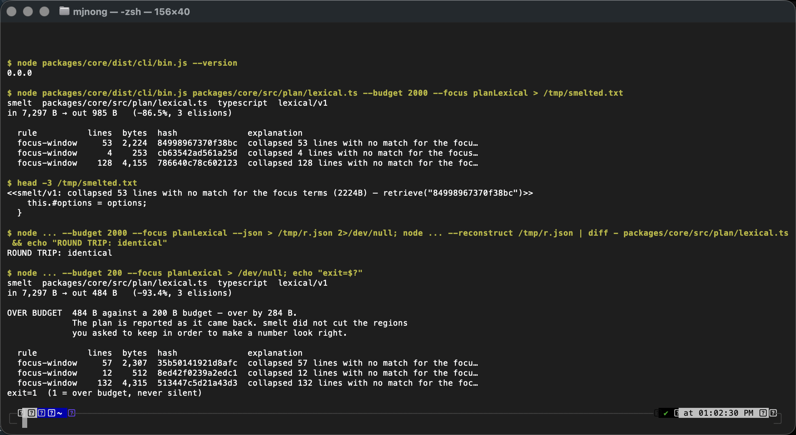

<div align="center">

</div>

# smelt — handoff

**Audience:** a competent engineer who has never seen this project. Read this before the
code. It says what smelt is, why each of its four laws exists, exactly what is scaffolded
versus what is yours to build, and the order to build it in.

**Status:** the spine is real and green, the CLI (Slice 1) ships, and the structural
planner (Slice 2) is real for TypeScript and TSX — `--strategy structural` parses with a
bundled grammar and collapses siblings by name. Nothing has been
published to npm; publishing is a founder action. The eight questions this document used
to end with are answered, in "Decisions the founder has made" below.

---

## What smelt is

smelt is a Node/TypeScript library that shrinks what a coding agent sends to a model,
without lying about what it removed. Given a blob of text — a file, a grep result, a
stack trace, a diff — and a byte budget, it returns a smaller blob in which the parts the
task needs survive and everything else has been replaced by a one-line marker that says
what went, how big it was, and a hash to get it back. The removed bytes are stored
locally, and the model is given a `smelt_retrieve` tool. Every retrieval is counted, so
over-pruning shows up as a number instead of as a model that is quietly wrong. It makes
no network calls, and a test fails if it could. It is a **library**, not a proxy: it
transforms content its caller hands it and never intercepts anyone's traffic.

---

## The four laws, and why each one is load-bearing

These are not preferences. Each one exists because breaking it produces a library that
_looks_ like it works, and a contributor acting in good faith will break them helpfully
unless they understand why they are there.

### Law 1 — zero network

**v1 makes no external calls. Code never leaves the machine.** Scoring is structural
(tree-sitter WASM) and lexical. Reranking exists as a _pluggable stage interface_ that a
consumer wires its own key into — never a default, never bundled.

_Why it is load-bearing:_ the natural way to make a context optimizer better is to ask a
model which parts matter. The moment that becomes a default, every consumer of smelt is
shipping their users' source code to a third party — and they find out from a changelog,
or a proxy log, or not at all. There is no way to opt out of a default you did not know
existed. The zero-network property is also the only reason smelt is usable inside
companies that will never approve an outbound call from a dev tool, which is a large
fraction of the people who need it most.

The subtle failure is not someone adding `fetch()` on purpose. It is a grammar cache:
`web-tree-sitter`'s `Language.load()` accepts `string | URL`, and "download the grammar
on first use" is a perfectly reasonable-looking optimisation that works flawlessly on the
machine that wrote it. That is why `src/plan/grammar.ts` reads the `.wasm` bytes itself
and hands tree-sitter a `Uint8Array` — removing the capability rather than documenting it
— and why `assertLocalResource()` rejects any non-`file:` scheme before that.

Enforced by `test/guards/no-network.test.ts`, which walks the real import graph and
classifies _every_ edge. See "How to prove a guard can fail" below.

### Law 2 — every elision is explainable

**Every removal can state what it removed, in words, from a named rule.** "collapsed 3
sibling functions, retrievable" — never a model's opinion, never "compressed by 62%".

_Why it is load-bearing:_ explainability is what makes the output debuggable and the
library trustworthy at the same time. When an agent gets an answer wrong, the first
question is "what did it not see?", and a marker that says `collapsed 3 sibling
functions` answers it while `[...truncated...]` does not. It also disciplines the
implementation: a rule you cannot describe in a sentence is a rule you do not understand,
and it will do something surprising. This is why `ElisionReason` has two fields — a
stable `rule` id for counters and an `explanation` a human reads — and why every planner
must fill in both.

The consequence people find surprising: **no learned distillation in v1.** A model-written
summary cannot satisfy this law. "The model condensed this" does not say what was
removed, and once the text has been rewritten there is nothing left to store under a
hash. The interface exists (`DistillStage`); the implementation does not.

### Law 3 — every elision is reversible

**What is elided is stored locally, keyed by content hash; the model gets a stub plus a
`retrieve(hash)` tool. Expansions are counted.**

_Why it is load-bearing:_ reversibility is what makes cutting safe enough to do
aggressively. But reversibility alone is trivially gameable — a library that hides 90% of
every file is "reversible" and useless — so the second sentence carries as much weight as
the first. **The expansion rate is the honest signal of over-pruning.** If the model keeps
calling `smelt_retrieve`, smelt cut material the task needed, and each round trip cost
more tokens than the elision saved. A retrieve counter that is not wired up leaves that
rate pinned at a flattering zero forever, which is precisely the shape of failure this
project exists to refuse — hence `test/guards/expansion-counter.test.ts` guarding an
increment.

Two design consequences worth understanding before you change them:

- `AppliedElision.outputRange` records where the marker landed in the _output_. Without
  it, "reversible" would mean parsing markers back out of text, which is a guess.
  Reversibility is a fact recorded at the moment of the cut.
- `MemoryElisionStore` has no eviction and no `clear()`. A store that can forget turns
  this law into "reversible, usually", and a `retrieve()` that fails after an eviction is
  indistinguishable to the model from a hallucinated hash.

### Law 4 — claim no number that has not been measured

**Absolute.** Not in the README, not in a doc comment, not in a commit message, not in a
tweet.

_Why it is load-bearing:_ this is the entire differentiator. The pitch smelt came from
claimed "80–94% token reduction" and a "90%+ cache hit rate". Both are unsupported: the
second conflates Anthropic's 0.1× _price_ for a cached read with a _hit rate_, which are
unrelated quantities, and no benchmark producing either figure exists. Publishing them
would have been the first thing a knowledgeable reader checked and the last thing they
believed.

What is honest to say instead: state the **mechanism** and the **class** of expected
saving _with its source_. The nearest real comparable is Headroom's own stated **15–20%
for coding agents** (its 60–95% figures apply to narrow content like JSON logs).
LLMLingua's 20× results are on non-code benchmarks. Until smelt has run its own harness
on its own traffic, the README states mechanisms and cites other people's numbers as
other people's. Slice 3 below is the harness that changes that.

---

## What is scaffolded, file by file

Everything below exists, is typechecked, linted, and covered. `pnpm verify` is green.

### Real implementations

| File                                | What it does                                                                                                                                                                                   |
| ----------------------------------- | ---------------------------------------------------------------------------------------------------------------------------------------------------------------------------------------------- |
| `packages/core/src/types.ts`        | The vocabulary: `Planner`, `ElisionPlan`, `AppliedElision`, `ElisionStore`, `RetrieveStats`, `Measure`, `RerankStage`, `DistillStage`. Read this first — the doc comments carry the reasoning. |
| `packages/core/src/errors.ts`       | Every error is a `SmeltError`, so callers can tell "the library said no" from "something broke".                                                                                               |
| `packages/core/src/hash.ts`         | 16 hex chars of sha256. Short because the hash goes in every marker and the model pays for it.                                                                                                 |
| `packages/core/src/detect.ts`       | Extension → language. `'unknown'` is a first-class answer, not a failure.                                                                                                                      |
| `packages/core/src/store.ts`        | `MemoryElisionStore`: content-addressed, dedupes, refuses hash collisions, counts retrievals.                                                                                                  |
| `packages/core/src/retrieve.ts`     | `createRetrieveTool()` — the `smelt_retrieve` tool a consumer hands its model. Not MCP- or SDK-specific on purpose.                                                                            |
| `packages/core/src/apply.ts`        | `applyPlan()` (the only function that removes anything), `reconstruct()` (Law 3 as an equation), and `MARKER_FORMAT_VERSION` — the wire surface, frozen. No judgement at all.                  |
| `packages/core/src/plan/lexical.ts` | The lexical planner: focus-window and head-tail rules, a context ladder under budget pressure, profitability check so a marker never costs more than the lines it replaces. Deterministic.     |
| `packages/core/src/plan/grammar.ts` | Loads a prebuilt grammar `.wasm` off disk, through `assertLocalResource`. Bundled copy first, `tree-sitter-wasms` as the source-checkout fallback. Cached.                                     |
| `packages/core/src/net/policy.ts`   | Law 1, written once: forbidden transports, forbidden globals, **and** the permitted sets — so the guard is a partition, not an allowlist.                                                      |
| `packages/core/src/cli/args.ts`     | `node:util.parseArgs`, zero new dependencies. `--budget` is required; its absence is a usage error, and so are `0`, `-1` and `4kb`. Also the help text.                                        |
| `packages/core/src/cli/report.ts`   | The stderr report. Every total is read off the `SmeltResult`: two pieces of code counting the same bytes is how a report ends up disagreeing with its own library.                             |
| `packages/core/src/cli/run.ts`      | The CLI as a function returning an exit code, so it runs in-process in tests. The `--json` envelope and the `--reconstruct` round trip live here.                                              |
| `packages/core/src/cli/bin.ts`      | The `smelt` binary. Owns only what cannot be tested without a real process: the shebang, stdin on fd 0, the exit code.                                                                         |
| `packages/core/src/index.ts`        | `createSmelter()` and the public surface.                                                                                                                                                      |

### Stubs that throw (by design — read `CONTRIBUTING.md` § "A stub throws")

| File                          | Why it throws                                                                                                                         |
| ----------------------------- | ------------------------------------------------------------------------------------------------------------------------------------- |
| `packages/core/src/stages.ts` | `unconfiguredRerankStage` and `unconfiguredDistillStage`. Both name the interface you were meant to implement. Out of v1 — see below. |

`packages/core/src/plan/structural.ts` is no longer a stub: **Slice 2 shipped it**, for
TypeScript and TSX. It still refuses rather than falling back — an unmapped language or
a failed grammar load throws `GrammarUnavailableError`, because output labelled
`structural/v1` that is really line windows is undetectable from outside.

### The honesty machinery

| File                                                  | What it guards                                                                                                                                                                                                                                    |
| ----------------------------------------------------- | ------------------------------------------------------------------------------------------------------------------------------------------------------------------------------------------------------------------------------------------------- |
| `packages/core/test/guards/no-network.test.ts`        | Law 1. Walks the import graph from **every entrypoint the manifest advertises** (`exports` + `bin`, so the CLI is in the walk); classifies every edge; closes the vacuous-walk, unwalked-file, unvetted-dependency and unwalked-entrypoint holes. |
| `packages/core/test/guards/reversibility.test.ts`     | Law 3. `reconstruct(smelt(x)) === x` over multi-byte, CRLF, no-trailing-newline and one-20 kB-line inputs, plus every refusal.                                                                                                                    |
| `packages/core/test/guards/expansion-counter.test.ts` | The retrieve counter and `allElisionsRetrieved`, i.e. the observability half of Law 3.                                                                                                                                                            |
| `packages/core/test/guards/marker-format.test.ts`     | The wire surface. The rendered marker is pinned per version: the format cannot change without the version changing, and an unknown version fails.                                                                                                 |
| `packages/core/test/guards/third-party.test.ts`       | Attribution. Reruns the real generator and fails if the committed `THIRD-PARTY.md` differs; also proves the generator refuses an unattributed grammar.                                                                                            |
| `packages/core/test/guards/persistent-store.test.ts`  | Law 3 across a process boundary. A damaged blob is refused as `StoreCorruptionError`, never returned; the retrieval counters survive a restart; "we hold damaged bytes" stays distinct from "never existed".                                      |
| `packages/core/test/guards/cache-hygiene.test.ts`     | Slice 6's promise: cache-prefix hygiene detects and warns, never rewrites — inputs stay unmutated, no export returns a "fixed" prompt, and no cache-hit-rate figure exists anywhere in `src`.                                                     |
| `packages/core/test/guards/_source.ts`                | Shared source-walking helpers: `guardSrcRoot()`, `guardRoot()`, and the string/comment stripper that stops `net/policy.ts` reporting its own word list.                                                                                           |
| `scripts/mutate.mjs`                                  | **The meta-guard.** Twenty-one mutations across the eight guards; each must go red. A survivor is reported as a hole in the guard, not the mutation.                                                                                              |
| `scripts/bundle-grammars.mjs`                         | Copies the grammars `WASM_BY_LANGUAGE` names into the package, so they ship. Reads the built map rather than keeping a second list.                                                                                                               |
| `scripts/generate-third-party.mjs`                    | Generates `THIRD-PARTY.md`. The grammar ↔ provenance mapping is a partition: an unattributed grammar throws.                                                                                                                                      |
| `scripts/check-fresh-clone.sh`                        | Installs and verifies from `git archive` output — tracked files only.                                                                                                                                                                             |
| `.github/workflows/ci.yml`                            | `pnpm verify` on Node 20.19/22.12/24, plus the fresh-clone job.                                                                                                                                                                                   |

### Not built at all

- No structural planning beyond TypeScript and TSX — the machinery generalises in
  **Slice 4**.
- No benchmark, so no number smelt owns. **Slice 3.**
- No cross-file reasoning: smelt sees one blob at a time. **Slice 7.**

---

## v1, sliced

Each slice is independently shippable and independently useful. Do them in order; the
ordering is not arbitrary — Slice 1 is how you _see_ Slice 2, and Slice 3 is what lets
you claim anything about Slice 2.

### Slice 1 — the demo surface: `smelt` CLI + a report — **SHIPPED**

The smallest thing that makes the library visible.

**Shipped as** a `bin` on `@smeltjs/core` (Decision 2), on `node:util.parseArgs`, with no
new dependencies:

```sh
smelt src/server.ts --budget 4000 --focus handleRequest
smelt --budget 4000 --focus TypeError < build.log
```

Prints the smelted text to stdout, and a report to stderr so the two can be piped apart:

A real run of the built binary, on this repository's own `plan/lexical.ts` — `--version`,
a smelt with its report, the marker it produced, the round trip closing byte for byte, and
the non-zero exit when the plan came back over budget:



The same run, as text:

```
smelt  packages/core/src/plan/lexical.ts  typescript  lexical/v1
in 7,297 B → out 985 B   (-86.5%, 3 elisions)

  rule          lines  bytes  hash              explanation
  focus-window     53  2,224  84998967370f38bc  collapsed 53 lines with no match for the focu…
  focus-window      4    253  cb63542ad561a25d  collapsed 4 lines with no match for the focus…
  focus-window    128  4,155  786640c78c602123  collapsed 128 lines with no match for the foc…
```

**Acceptance criteria**

- [x] `smelt <file>` and stdin both work; `--budget` is required and its absence is an error, not a default.
- [x] `--json` emits the `SmeltResult` verbatim, so it can be diffed in tests. It is nested in a versioned envelope alongside the elided bytes, because a result without its store is not reconstructible; `test/cli.test.ts` asserts the nested result equals the library's own, field for field.
- [x] The report totals equal `inputBytes`/`outputBytes` from the result — no separate accounting.
- [x] `--reconstruct` reads a `--json` result back and prints the original, proving the round trip from the command line. It verifies every hash against the bytes it keys and the reconstructed length against the recorded `inputBytes`, so an almost-right round trip fails.
- [x] Exit code is non-zero when the plan came back over budget, and says so. Never silently over budget. Codes are distinct: 1 over budget, 2 usage, 3 refused, 4 unexpected.
- [x] A screenshot of the built binary running on a real file: [`docs/images/slice-1-cli.png`](images/slice-1-cli.png). `node packages/core/dist/cli/bin.js` — the built artifact, not the dev server and not test output.

**Not in Slice 1, deliberately:** the CLI has no way to pass a `Measure`. A CLI flag
cannot name a function, and a plugin loader would be a dependency and an eval surface.
The report prints a measured line when the _library_ was given one.

### Slice 2 — the structural planner, TypeScript and TSX only — **SHIPPED**

The reason smelt exists. Scope it to two grammars; the machinery generalises in Slice 4.

**Build:** in `src/plan/structural.ts`, replace the throw. Parse with the language's
grammar; find nodes matching `focus`; for each match, keep its enclosing declaration —
signature, doc comment, body — and collapse its _siblings_ into one marker naming them.

**Acceptance criteria**

- [x] `collapsed 3 sibling functions` — the explanation names the _kind_ and the _count_, from the parse tree, not a line count.
- [x] A kept declaration keeps its signature line and attached doc comment, always. A fixture asserts this on a file where the doc comment is 40 lines long.
- [x] Ranges never split a multi-byte character and never cross a node boundary. The reversibility guard already covers the first; add a fixture for the second.
- [x] Grammar load failure throws `GrammarUnavailableError`. It does **not** fall back to lexical. A caller who wants the fallback asks for it.
- [x] Deterministic: same file, same focus, byte-identical plan. Asserted, not assumed.
- [x] A snapshot test per fixture, so a plan change shows up as a reviewable diff.
- [x] `pnpm mutate` gains a mutation for whatever new guarantee this slice claims.

### Slice 3 — the measurement harness

The slice that lets smelt say a number. Until this exists, Law 4 forbids all of them.

**Build:** `packages/core/bench/` — a corpus of real tool outputs (files, greps, stack
traces, `cargo build` output), a set of realistic tasks with known answers, and a runner
that reports, per case: input bytes, output bytes, elisions, and — critically —
**expansion rate**, by actually asking a model and counting its `smelt_retrieve` calls.

**Tiers** — decided (Decision 8), not built. `count_tokens` is free, which is what makes
this affordable: Tier 1 is bytes and elision counts, deterministic, no key, reproducible
by any contributor offline. Tier 2 adds token counts through `count_tokens` — free, needs
any key. Tier 3 is expansion rate, the only paid part: run it once and commit the
retrieval log as an artifact so the rate is checkable from a committed file. Every row
names its model, and re-running on a newer model is a **new row, not an edit** — Claude's
tokenizer changed by ~30% between generations, and an edit would silently rewrite history.

**Acceptance criteria**

- [ ] The corpus is committed, or fetched from a pinned public commit. Reproducible by a stranger.
- [ ] Reports bytes _and_ tokens, per the tiers above. Never a byte count converted to tokens with a fudge factor.
- [ ] Reports expansion rate per case, and the aggregate. A case where the model retrieved everything back is reported as a **loss**, with its input.
- [ ] Output is a committed markdown table with the date, the corpus commit, and the model used. A number without those three is not a measurement.
- [ ] The README's numbers section is written from this table or stays empty. No rounding up, no "up to".
- [ ] The harness has no network access on the smelt side. Model calls are the harness's, made explicitly, outside the library.

### Slice 4 — structural planning for Rust, Python and Go

Same machinery, three more node-kind sets.

**Acceptance criteria**

- [ ] One fixture per language, each with a sibling collapse and a preserved doc comment (`///`, docstring, `//`).
- [ ] Python's significant indentation does not produce a marker that breaks the block structure of what remains. A fixture asserts the survivor still parses.
- [ ] `SUPPORTED_LANGUAGES` and `WASM_BY_LANGUAGE` stay total — adding an id without a grammar is already a compile error; keep it that way.
- [ ] Bench numbers from Slice 3 re-run and committed, per language.

### Slice 5 — a persistent elision store — **SHIPPED**

Elisions used to die with the process. A long-lived agent session outlives the process.

**Shipped as** `DirectoryElisionStore` (`src/store-dir.ts`): a second `ElisionStore` over
a content-addressed directory, `node:fs` only — SQLite would have been either a new
runtime dependency (`better-sqlite3`) or `node:sqlite`, which is not stable across the
supported engine range. The storage layout is documented on the class.

**Acceptance criteria**

- [x] A second `ElisionStore` implementation over SQLite or a content-addressed directory. The interface does not change. The reversibility and expansion-counter guards run against both stores.
- [x] Still no eviction — no cap at all, so no "evicted" error exists to need. If a size cap is genuinely required, retrieval of an evicted hash must throw a _distinct_ error that says "evicted", never `UnknownHashError` — the model must be able to tell "never existed" from "we lost it". (The class doc restates this for whoever adds a cap.) The same distinction already exists for damage: a blob whose bytes no longer hash to their name throws `StoreCorruptionError`, never `UnknownHashError`, and reads verify bytes against the hash so a torn write can never be handed back as a faithful retrieval.
- [x] Counters survive a restart: every retrieval appends one fsynced line to an append-only journal, and `stats()` is a fold over it, so `expansionRate` stays meaningful across a session.
- [x] Concurrent writers do not corrupt the store. Tested with two processes, not two promises — `test/store-dir.test.ts` spawns two real `node` subprocesses against one directory. Writes are write-temp → fsync → `link(2)` (atomic, no-clobber), and `pnpm mutate` proves the verify-on-read and counter-persistence guards can go red.

### Slice 6 — cache-prefix hygiene — **SHIPPED**

Provider prompt caches invalidate on any prefix byte change, so a context optimizer that
reorders or rewrites a prompt prefix can cost more than it saves. Headroom's CacheAligner
detects and warns about this volatility; **it never rewrites**, and neither does this.

**Shipped as** `src/cache/prefix.ts` — pure functions, zero new dependencies, exported
from the package entrypoint. Provider cache facts (byte-matched prefix over
tools → system → messages, ≈1024-token minimum, 4 breakpoints, 5 min/1 h TTL,
1.25×/2× write and ≈0.1× read pricing) are encoded as cited constants naming
Anthropic's docs and the date they were verified. Guarded by
`test/guards/cache-hygiene.test.ts`, with two mutations proving it goes red.

**Acceptance criteria**

- [x] A function that, given two successive prompt prefixes, reports the byte offset of first divergence and what changed — `findPrefixDivergence()`, UTF-8 byte offsets, excerpts that never split a multi-byte character.
- [x] Warnings only. No automatic rewriting of anybody's prompt — an optimizer that silently edits a prefix to help a cache is exactly the class of magic this library refuses. `detectCacheBreakers()` names each silent breaker (system-prompt timestamps and UUIDs, unsorted JSON keys, a tool set that varies between calls) with the `ElisionReason`-style rule id + explanation pair; the guard asserts on frozen inputs that nothing is ever mutated or "fixed".
- [x] No claim about cache hit rates anywhere. See Law 4; this is the specific claim that was wrong in the original pitch. The guard scans every source file for the phrase and a mutation proves the scan can go red.

### Slice 7 — the repo-map planner (cross-file)

smelt sees one blob. Aider's repo-map is the proven prior art for the other shape: whole
repository, tree-sitter tags, PageRank over the reference graph, a token budget, and a
cache.

**Acceptance criteria**

- [ ] Reads a repo, emits a ranked symbol map inside a byte budget.
- [ ] Ranking is deterministic and explainable — every included symbol can say why it ranked.
- [ ] Cached on disk, invalidated by content hash, no network.
- [ ] Credits Aider's repo-map explicitly, in the code and the README.

---

## How to run, test, lint

```sh
pnpm install
pnpm verify        # format:check → lint → typecheck → build → test → mutate
```

Individual gates: `pnpm build`, `pnpm test`, `pnpm typecheck`, `pnpm lint`,
`pnpm format`, `pnpm mutate`. Generated files: `pnpm generate:third-party` rewrites
`packages/core/THIRD-PARTY.md`, and `pnpm build` refills `packages/core/grammars/` —
neither is hand-edited, and a stale `THIRD-PARTY.md` fails `pnpm test`. Fresh-clone check:
`bash scripts/check-fresh-clone.sh` (installs from `git archive` output — tracked files
only). CI runs `pnpm verify` on Node 20.19/22.12/24 plus the fresh-clone job.

### How to prove a guard can fail

This is the part not to skip, and it is why `pnpm mutate` exists:

```sh
pnpm mutate
```

It copies `packages/core/src` to a scratch tree, applies one deliberate break, points the
guard at the copy via `SMELT_GUARD_SRC`, and asserts the guard goes **red**. Twenty-one
mutations across eight guards; a survivor is reported as a hole in the guard, not in the
mutation.

Not every guard guards source code, so there is a second mutation kind: an `artifact`
mutation stales a _committed artefact_ — `THIRD-PARTY.md`, for instance — in a scratch
root the guard reads through `SMELT_GUARD_ROOT`. Nothing in the working tree is touched
either way, which is the point: a mutation runner that edits tracked files and then
crashes leaves the repository broken, and a failure here has to be safe.

The hand-run transcript of the zero-network guard failing — a real `node:https` import and
a real `fetch()` added to `plan/lexical.ts`, the exact output, then reverted — is in
[`CONTRIBUTING.md` § "The recorded failure"](../CONTRIBUTING.md#the-recorded-failure-watching-the-zero-network-guard-go-red).
Read it before you add a guard of your own; the convention for new guards is in the same
file.

---

## The KLØDD integration contract

smelt is **used by, but not part of**, the KLØDD app. KLØDD is a consumer like any other,
and nothing in this repo depends on it, references it, or requires access to it. This
section exists so v1 can be built to a real contract without seeing that codebase.

**What a consumer depends on — the stable surface:**

```ts
import { createSmelter } from '@smeltjs/core';

const smelter = createSmelter({
  defaultBudgetBytes: 8_000,
  // store: myPersistentStore,   // optional; see Slice 5
});

// 1. Shrink tool output before it reaches the model.
const result = await smelter.smelt(toolOutput, {
  path: 'src/server.ts', // language detection
  focus: ['handleRequest'], // what the caller was actually looking for
  budgetBytes: 4_000, // per-call override
});
// → result.text            what you send
// → result.elisions        what was cut, each with rule, explanation, bytes, hash
// → result.inputBytes / result.outputBytes

// 2. Expose the retrieval tool to the model, in your own SDK's shape.
const { name, description, inputSchema, invoke } = smelter.tool;
//   name === 'smelt_retrieve'; invoke({ hash }) → the exact original bytes
//   throws UnknownHashError on an unknown hash — surface that to the model as a
//   tool error, never as empty text

// 3. Watch the honest signal.
const { expansionRate, retrieveCalls, elisionsStored, allElisionsRetrieved } = smelter.stats();
//   allElisionsRetrieved === true means every blob smelt hid was asked for again: the
//   elision saved nothing and cost a round trip. There is no threshold below that,
//   deliberately — see Decision 4.
```

**Optional: count in your own unit.** Budgets stay bytes (Decision 1). If you want tokens
in the result as well, hand smelt the counter you already have:

```ts
const smelter = createSmelter({
  defaultBudgetBytes: 8_000,
  measure: { id: 'tiktoken/o200k_base', unit: 'tokens', count: (text) => encode(text).length },
});
// → result.measured = { measure, unit, input, output }
```

**Also available:** the `smelt` binary, for seeing all of the above from a shell without
writing a script. `smelt <file> --budget <bytes> --focus <term>` prints the text on stdout
and the report on stderr; `--json` and `--reconstruct` round-trip through a file.

**Guarantees a consumer may rely on:**

1. `smelt()` makes no network calls of its own, ever, in any version. If that changes,
   the package name changes. (A `measure` or `RerankStage` you supply is your code
   running in your process; smelt's guard covers smelt's modules, not yours.)
2. `smelt()` does not mutate its input and is deterministic for a given input, options
   and version.
3. The tool name is `smelt_retrieve` and will not be renamed.
4. Every `AppliedElision` has a non-empty `reason.rule` and `reason.explanation`.
5. `reconstruct(result)` returns the original text byte for byte, as long as the store
   still holds the bytes.
6. Every thrown error is an `instanceof SmeltError`.
7. **The marker format is stable from 0.1 and treated as 1.0.** `<<smelt/v1: … >>` will
   not change shape. A future format arrives as `smelt/v2`, identifiable in band, never
   as a quiet substitution — see Decision 3, and the guard that enforces it.
8. Budgets are UTF-8 bytes, permanently. A `Measure` you supply adds a labelled second
   number to the result; it never changes what the budget means.

**Two promises, not one.** The **wire surface a model sees** — the marker format and the
`smelt_retrieve` tool contract — is stable now. The **TypeScript API** is `0.x` and may
move: expect renames and signature changes in the type surface between minors.

**What is explicitly _not_ stable pre-1.0:** the TypeScript API, the rule ids, the
lexical planner's tuning constants, and the exact set of elisions for a given input.
A consumer that snapshot-tests smelt's output will break on a planner improvement —
snapshot the _properties_ (round-trips, under budget, focus preserved) instead. Note what
is **no longer** on this list: the marker string. It moved to the guarantees, because
consumers put it in prompts.

**What smelt will never do to a consumer:** intercept its traffic, read its config, write
outside a store it was handed, or require a key.

---

## Explicitly out of v1

**The external reranker.** A hosted reranker would improve relevance and is exactly why
`RerankStage` exists as an interface. It is out because a _default_ reranker breaks Law 1
for every consumer at once, including the ones who never read the changelog. A consumer
who wants one implements the interface in their own code, with their own key, so that the
outbound call is visible in their own source and their own review. There is no
`SMELT_RERANK_API_KEY`, no bundled adapter, and no "just set this env var" — the first of
those to appear turns a zero-network library into a library that is zero-network unless
configured, which is not the same claim.

**An example reranker in the repository.** Out (Decision 5). The README shows the snippet
and `RerankStage` is the interface; there is nothing under `examples/`, and there will not
be. The zero-network guard requires every discovered `.ts` file to be reachable from a
manifest entrypoint or explicitly justified, so a file importing an HTTP client either
breaks the guard or gets excluded from it — and **excluding a file from an honesty guard
to accommodate an example is how a guard erodes.** Naming a vendor in-repo also dates the
project: Voyage's `voyage-code-3` is already legacy.

**The learned distillation stage.** Out for a reason beyond the network: a model-written
summary cannot satisfy Law 2. "The model condensed this" is not a statement of what was
removed, and a rewritten paragraph leaves nothing to store under a hash, so Law 3 goes
too. If this ever ships, it stores the original, explains itself in the same rule-named
terms every other elision uses, and is reversible — or it does not ship.
`DistillStage` exists so that shape is written down, not so it can be filled in quietly.

**Learned localization** (SweRank, LocAgent, Agentless). Genuinely better at finding the
right code than lexical scoring, and genuinely a v2 conversation: it means a model in the
retrieval path, which is both laws again. Named in the README as prior art precisely so
nobody thinks smelt invented structural retrieval.

**Being a proxy.** A proxy can be built _on top of_ this library. The library never
intercepts requests it was not handed, because "we rewrote your agent's traffic" and "we
transformed the string you gave us" have very different failure modes and only one of
them is debuggable.

---

## Decisions the founder has made

These were the open questions. They are answered, and each answer has a home in the code
or the docs — so what follows is a record of what was decided and why, not a list of
things still to settle. Where a decision is enforced by a check, the check is named.

### 1. Budgets are UTF-8 bytes, permanently, in the core

Not a caveat. **Bytes are the only unit computable locally for every model**, which is
exactly why they are the core's unit — the same property that makes Law 1 possible.

Three facts settled it, verified against Anthropic's documentation on 2026-09-01:

- **There is no local tokenizer for Claude.** Anthropic ships only the
  `/v1/messages/count_tokens` **endpoint** — no downloadable tokenizer, no BPE
  vocabulary. A token budget inside `smelt()` would require a network call, which is
  Law 1 gone.
- **A token budget silently redefines itself across model generations.** Verbatim from
  Anthropic's docs: _"Claude 4.7 and later models and Claude Mythos Preview use a newer
  tokenizer. The same input text produces approximately 30 percent more tokens than on
  earlier models."_ A byte budget means the same thing in five years. A token budget
  quietly got 30% tighter with nothing erroring anywhere — this project's own failure
  class, arriving as someone else's model release.
- Per-provider tokenizers multiply the dependency cost on every consumer, and a coding
  agent talks to more than one provider.

**Built:** a `measure` hook on the public API (`Measure` in `src/types.ts`,
`SmelterConfig.measure`). A consumer supplies its own counter — anyone calling a model
already has one — and the result carries `measured: { measure, unit, input, output }`
alongside the byte counts. `id` and `unit` are **required**, because a token count
without the tokenizer named is not a measurement; the 30% shift above is precisely why.

The hook **does not relax Law 1.** smelt imports no transport, and the guard proves that
about smelt's modules; it cannot prove it about a function you hand in. A `count()` that
calls an API makes _your_ process call an API, from a line in _your_ source — the same
arrangement `RerankStage` already describes. `count` is synchronous on purpose: local
tokenizers are synchronous and network clients are not.

### 2. The CLI is a `bin` on `@smeltjs/core`, with zero new dependencies

`node:util.parseArgs`, stable in Node 20, which `engines` already requires. The case for
a second package was dependency-tree size, and it dissolves when the CLI adds nothing.
One package, one version, one install.

### 3. Two promises, not one — and this constrains every slice

- **The wire surface a model sees** — the marker format and the `smelt_retrieve` tool
  contract — is **stable from 0.1 and treated as 1.0.**
- **The TypeScript API** is `0.x` and may move.

Why, spelled out in `CONTRIBUTING.md` § "Two promises, not one" so a contributor does
not "clean up" the marker format: **the marker goes into prompts.** Changing it changes
model behaviour downstream and manifests as _worse output with no error anywhere_. That
is not a normal API break; it is this project's signature failure mode shipped as a
version bump.

**Built:** the marker carries its own version in band — `<<smelt/v1: … >>` — so a future
format is additive and identifiable rather than a silent substitution.
`MARKER_FORMAT_VERSION` lives in `src/apply.ts`, and
`test/guards/marker-format.test.ts` pins the exact rendering per version: the format
cannot move without the version moving, and an unknown version fails rather than
passing, so a new format is a new row and never an edit. Two mutations
(`marker-format-silent-change`, `marker-version-not-frozen`) prove both halves go red.

### 4. Measure the expansion rate; never threshold it

No default threshold. It would be a policy claim smelt has no basis for, the right rate
depends on how aggressive a budget the consumer chose, and a library printing warnings
into someone else's process is bad manners.

**Built:** `RetrieveStats.allElisionsRetrieved` — the one non-arbitrary case, exposed as
a computed fact rather than a preference. When every distinct blob smelt hid has been
asked for again, the elision achieved nothing and cost a round trip. That is arithmetic,
not an opinion, and what to do about it is the caller's call. Guarded in
`test/guards/expansion-counter.test.ts`; mutation `degenerate-outcome-never-fires` wires
the flag to a constant and the guard goes red.

### 5. No example reranker in the repo

A README snippet and the stage interface, and **nothing under `examples/`**. The
zero-network guard requires every discovered `.ts` file to be reachable from a manifest
entrypoint or explicitly justified. A file importing an HTTP client either breaks that
guard or gets excluded from it — and **excluding a file from an honesty guard to
accommodate an example is how a guard erodes.** Separately, naming a vendor in-repo
dates the project: Voyage's `voyage-code-3` is already legacy.

### 6. The grammars are bundled, and `THIRD-PARTY.md` is generated

The WASM grammars **ship inside the npm tarball** — that is what makes "zero native
compilation, works offline" true. Before this, `tree-sitter-wasms` was an _optional peer
dependency_, so a consumer installing `@smeltjs/core` got no parsers at all and found
out from a `GrammarUnavailableError` on someone else's machine. `pnpm build` copies them
into `packages/core/grammars/` and `files` packs them.

Bundling is redistribution, so attribution is required rather than polite.
`scripts/generate-third-party.mjs` produces `THIRD-PARTY.md` from installed package
metadata, the bundled files themselves, and `grammar-provenance.json` — which holds only
the facts with no machine-readable source here. It is **never hand-written**, because a
hand-written notices file is a promise that decays: a grammar gets added, the file does
not, and nothing fails. `tree-sitter-wasms` is Unlicense (the packaging); each grammar
inside carries its own licence, and all six are MIT, verified 2026-09-01 against the npm
registry and each repository's `LICENSE`. Even the MIT body is quoted from an installed
`LICENSE` rather than typed into the generator.

`test/guards/third-party.test.ts` reruns the real generator and fails if the committed
copy differs, so staleness is loud rather than silent. Downstream reason to get this
right: **KLØDD ships in two app stores** and takes its licence screen text from here.

### 7. npm: nothing is published, and publishing is a founder action

The `@smeltjs` org exists. Nothing has been published. **Do not publish, and do not run
`npm login`** — that is the founder's action, not an agent's.

What is done here instead: the manifest is correct for the `bin` and for the bundled
grammars, and `CONTRIBUTING.md` carries a publish checklist. The ordering rule in it
matters — **npm unpublish is restricted after 72 hours**, after which only deprecate
remains, so a premature `0.0.1` is permanent. Publish after Slice 1 lands and
`smelt --budget` actually runs on a real file, never before.

### 8. Benchmark tiers — recorded here, built in Slice 3

Not built. Recorded so Slice 3 starts from a decision rather than a debate.
`count_tokens` is **free** — _"Token counting is free to use but subject to requests per
minute rate limits"_, 5,000 RPM at the Start tier, with limits independent of message
creation — which is what makes a three-tier split affordable:

| Tier | What it reports                   | Cost | Key needed | Who can reproduce it     |
| ---- | --------------------------------- | ---- | ---------- | ------------------------ |
| 1    | Bytes and elision counts          | none | none       | any contributor, offline |
| 2    | Token counts, via `count_tokens`  | free | any key    | anyone with a key        |
| 3    | Expansion rate — real model calls | paid | any key    | anyone, from the log     |

Tier 1 is deterministic and needs no key, so a stranger can reproduce the table's
structural half exactly. Tier 3 is the only paid part: run it once and **commit the
retrieval log as an artifact**, so the rate is verifiable from a committed file rather
than from trust.

**The trap to write down now:** tokenizers differ by model, so every table row names its
model, and re-running on a newer model is a **new row, not an edit**. See Decision 1 —
the 30% shift between Claude tokenizer generations would otherwise silently rewrite
history.
